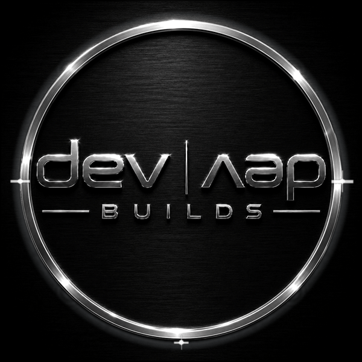

# devdevbuilds

  

## Backend-focused developer · Cybersecurity student · Practical systems builder

“To design is to communicate clearly by whatever means you can control or master.”
— Milton Glaser

I build backend-focused software projects around APIs, databases, automation, defensive monitoring, local infrastructure, GIS workflows, event processing, dashboards, and technical documentation.

My work focuses on practical systems that are:

* Clear enough to understand quickly
* Useful beyond a demo screen
* Built around real workflows
* Database-backed where it matters
* Documented for technical review
* Strong enough to support a portfolio, client handoff, or recruiter screen

I am especially interested in backend engineering, cybersecurity-aware software, payment-platform workflows, event-driven APIs, local AI tooling, infrastructure dashboards, and repository documentation that does not look like it was assembled during a power outage.

---

## Current Focus

* Backend API development
* REST-style API design
* Database-backed applications
* Webhook ingestion and event processing
* Payment-platform backend systems
* Security-aware backend design
* Request logging and authentication workflows
* SQLite, Prisma, and database modeling
* Local dashboards and monitoring interfaces
* GIS and geofencing backend systems
* Local AI assistant infrastructure
* Windows and local workflow automation
* GitHub repository cleanup and documentation polish
* Markdown documentation and technical writing

---

## Skills & Tools

### Backend, APIs & Data

`REST APIs` · `Request Routing` · `JSON Responses` · `API Key Auth` · `Schema Design` · `Event Storage` · `Log Storage` · `Data Filtering` · `Query Reporting`

---

### TypeScript Backend Tooling

`NestJS` · `Service Layer Architecture` · `Controller Logic` · `Request Validation` · `Prisma Models` · `SQLite Persistence` · `Testing` · `API Documentation`

---

### Security, Infrastructure & Monitoring

`Defensive Tooling` · `Request Logging` · `System Monitoring` · `Network Visibility` · `Authentication Attempts` · `Raspberry Pi Deployment` · `Local Infrastructure`

---

### Frontend, Workflow & Documentation

`Dashboard UI` · `Status Cards` · `Monitoring Views` · `README Writing` · `Project Planning` · `Testing Checklists` · `Setup Guides` · `Repository Polish`

---

## Featured Backend Projects

### 1. ZeroSOC

ZeroSOC is a lightweight home-lab SOC dashboard built with Python, SQLite, and a simple browser-based frontend.

**Tech Focus:**
Python, SQLite, REST-style APIs, API key authentication, request logging, dashboard UI, Raspberry Pi deployment, defensive monitoring

**What it does:**

* Monitors local system health
* Tracks backend API activity
* Stores security events in SQLite
* Logs API requests and authentication attempts
* Scans local network devices
* Detects unknown devices
* Displays security and system data through a browser dashboard

**Backend Skill Signal:**
Shows API design, authentication, persistent storage, request logging, defensive monitoring, local network visibility, event tracking, and dashboard-connected backend workflows.

**Portfolio Value:**
ZeroSOC demonstrates the type of backend/security work I want to keep building: practical, local-first, observable, documented, and connected to a real use case.

---

### 2. Webhook Receiver + Event Processing API

Webhook Receiver + Event Processing API is a backend project for receiving, validating, storing, reviewing, and processing webhook-style event records.

**Tech Focus:**
NestJS, TypeScript, Prisma, SQLite, REST APIs, validation, database persistence, service/controller architecture, testing, documentation

**What it does:**

* Receives webhook-style event payloads
* Validates incoming request data
* Stores event records in SQLite through Prisma
* Exposes endpoints for creating and retrieving events
* Tracks event processing status
* Supports event filtering and event summaries
* Uses structured service/controller backend architecture
* Includes test coverage and API documentation

**Backend Skill Signal:**
Shows practical backend API development with a modern TypeScript stack, database modeling, request validation, endpoint design, service/controller separation, testing discipline, and clean repository documentation.

**Portfolio Value:**
This project highlights backend fundamentals that transfer directly into production-style API work: validation, persistence, status tracking, documentation, and structured code organization.

---

### 3. PayFlow Ledger

PayFlow Ledger is a backend project concept focused on payment-platform webhook handling, event reconciliation, and transaction review workflows.

**Tech Focus:**
Payment workflows, webhook ingestion, backend APIs, event processing, reconciliation logic, database design, audit-friendly records

**Planned Features:**

* Receive payment-provider webhook events
* Store payment, refund, payout, and dispute-style records
* Normalize event data from multiple providers
* Track processed and unprocessed payment events
* Compare received events against stored transaction records
* Surface reconciliation status through API endpoints
* Provide clean documentation for payment event flows

**Backend Skill Signal:**
Shows backend experience with realistic payment-platform problems such as webhook handling, event normalization, persistence, transaction review, reconciliation, and audit-friendly API design.

**Portfolio Value:**
This project supports my backend direction by focusing on real business logic: financial event flow, state tracking, reconciliation, and clean API design.

---

### 4. GeoFence Alert API

GeoFence Alert API is a backend project focused on geofencing, alert logic, and location-based event handling.

**Tech Focus:**
NestJS, backend APIs, geospatial logic, database-backed location data, alert workflows, API documentation

**Planned Features:**

* Receive and process location data
* Store geofence zones and location events
* Evaluate whether a location enters or exits a geofence
* Trigger alerts based on geofence rules
* Expose clean API endpoints for location-aware applications
* Document endpoints, request examples, and backend behavior

**Backend Skill Signal:**
Shows backend portfolio diversity through geospatial logic, event-driven alerting, database design, API architecture, and location-aware backend systems.

**Portfolio Value:**
GeoFence Alert API expands my backend portfolio beyond standard CRUD by adding geospatial decision logic and alert workflows.

---

### 5. SentinelLLM

SentinelLLM is a local AI and backend-focused assistant project built around private, local-first workflows.

**Tech Focus:**
Local AI infrastructure, backend request handling, chat interfaces, prompt controls, settings management, privacy-focused workflows

**What it does:**

* Runs local AI assistant workflows
* Connects backend logic to a browser-based chat interface
* Handles user prompts and model requests
* Explores local model integration
* Supports private, local-first AI experimentation
* Provides a foundation for AI automation and assistant tooling

**Backend Skill Signal:**
Shows experience with backend-connected AI systems, user-facing interfaces, local infrastructure, prompt handling, privacy-aware design, and applied AI workflow development.

**Portfolio Value:**
SentinelLLM shows how backend systems can support local AI tools, private workflows, and browser-based assistant interfaces.

---

### 6. WinTidy

WinTidy is a Windows maintenance and workflow automation project focused on organizing repeatable cleanup, diagnostic, and system review tasks through a simple local dashboard.

**Tech Focus:**
Windows workflows, automation scripts, diagnostics, cleanup routines, local dashboard UI, status cards, system checks, documentation

**What it does:**

* Provides a local dashboard for Windows maintenance workflows
* Displays maintenance status through simple dashboard cards
* Organizes cleanup and diagnostic tasks into repeatable workflows
* Supports system health review and utility-style checks
* Documents safe maintenance steps and expected outputs
* Creates a foundation for future automation, logging, and task history
* Turns command-based maintenance work into a clearer browser-based interface

**Backend Skill Signal:**
Shows practical automation thinking, Windows support awareness, dashboard-connected workflow design, technical documentation, and the ability to turn routine system maintenance into a usable local tool.

**Portfolio Value:**
WinTidy supports my automation and tooling direction by turning scattered system tasks into clearer, repeatable workflows.

---

## In the Works

### GhostBrain Infinity by devdevbuilds

GhostBrain Infinity is an in-progress local-first AI knowledge dashboard designed to organize, visualize, and manage records from multiple AI tools, model sources, prompt workflows, project files, and connected knowledge bases through a polished interactive interface.

**Tech Focus:**
Local AI workflows, dashboard UI, source/model registries, data visualization, import/export persistence, graph logic, metadata cleanup, project organization, Obsidian integration, frontend/backend planning

**Planned Direction:**

* Build a clean new app foundation instead of patching a broken dashboard forward
* Create a dark metallic dashboard interface with raised/embossed controls
* Organize AI records by source, model, category, and project context
* Support sources such as ChatGPT, Codex, Claude, Gemini, Midjourney, local models, manual notes, and research files
* Provide an Obsidian-style source/model registry
* Integrate with Obsidian vaults to import, organize, and connect notes alongside AI-generated records
* Support markdown-based workflows and preserve links, tags, and note relationships from existing Obsidian knowledge bases
* Display records through an interactive vault-style graph inspired by connected knowledge management systems
* Include filtering, node inspection, activity feeds, import/export tools, and local persistence
* Clean metadata and reduce clutter from AI session exports
* Create a polished portfolio-ready interface under the devdevbuilds brand system

**Backend Skill Signal:**
Shows planning around data modeling, source registries, Obsidian vault integration, import/export workflows, local persistence, structured records, metadata handling, graph relationships, and dashboard-connected logic for AI workflow management.

**Portfolio Value:**
GhostBrain Infinity demonstrates a stronger full-system direction: local AI organization, backend-style data thinking, interactive dashboard design, source tracking, Obsidian-compatible knowledge management, and practical tooling for managing modern AI workflows without letting every export turn into a haunted junk drawer.

---

## Supporting Technical + Documentation Projects

### devdevbuilds Icon Pack

devdevbuilds Icon Pack is a custom developer-themed icon set designed for GitHub profiles, technical documentation, project READMEs, dashboards, and portfolio visuals.

**Tech Focus:**
GitHub profile assets, visual documentation, developer branding, icon naming, asset organization, repository structure, Markdown usage

**What it does:**

* Provides reusable square icons for developer and backend project documentation
* Organizes icons by clear file names and usage purpose
* Supports GitHub README visuals, project sections, badges, and portfolio layouts
* Creates a consistent visual language for backend, security, API, database, and workflow topics
* Documents naming conventions and usage standards for a reusable icon asset library

**Portfolio Value:**
Shows visual documentation skill, repository organization, GitHub presentation polish, asset naming discipline, and the ability to create reusable design systems for technical projects.

---

## Documentation & Repository Cleanup Services

I help turn rough or underdeveloped repositories into clearer, more professional project pages.

My focus is practical repository improvement: making projects easier to understand, easier to navigate, and better suited for portfolios, clients, recruiters, collaborators, and technical review.

### Services I Can Help With

* GitHub profile README cleanup
* Project README rewrites
* Repository structure cleanup
* Markdown formatting and visual polish
* Badge setup and organization
* Project descriptions and repo topics
* API documentation
* Setup and installation guides
* Environment variable documentation
* Feature documentation
* Testing notes and checklists
* Roadmaps and project status sections
* Client-facing project summaries
* Portfolio-ready project presentation

---

## What I Can Improve in a Repository

| Area                | What I Improve                                                               |
| ------------------- | ---------------------------------------------------------------------------- |
| README              | Structure, clarity, formatting, badges, setup instructions, usage examples   |
| Documentation       | API docs, feature notes, environment setup, testing notes, project guides    |
| GitHub Presentation | Repo description, topics, pinned repo polish, profile README layout          |
| Project Clarity     | Purpose, tech stack, current status, feature list, roadmap                   |
| Backend Projects    | Endpoint documentation, request/response examples, setup notes               |
| Portfolio Value     | Turning rough projects into cleaner, client- or recruiter-ready repositories |

---

## Freelance & Client-Focused Services

I can help with practical technical work such as:

* GitHub profile README design
* Repository cleanup and documentation
* Markdown documentation
* Backend API documentation
* Project setup and structure cleanup
* Technical writing for developer portfolios
* Simple automation scripts
* README badges, sections, and visual polish
* Client-facing project summaries
* Basic GitHub Actions setup for profile or documentation workflows

---

## GitHub Stats

---

## Contribution Activity

<picture>
  <source media="(prefers-color-scheme: dark)" srcset="https://raw.githubusercontent.com/britbufkin1225-web/britbufkin1225-web/output/github-contribution-grid-snake-dark.svg">
  <source media="(prefers-color-scheme: light)" srcset="https://raw.githubusercontent.com/britbufkin1225-web/britbufkin1225-web/output/github-contribution-grid-snake.svg">
  
</picture>

---

## What I Am Building Toward

I am building a backend-focused portfolio that demonstrates practical experience with APIs, databases, automation, security-aware systems, infrastructure tooling, GIS backends, local AI workflows, dashboards, documentation, and applied software projects.

My goal is to build software and repositories that are:

* Useful beyond a demo screen
* Easy to understand
* Testable and documented
* Built around real workflows
* Connected to practical backend and security use cases
* Clear enough for clients, collaborators, and recruiters to evaluate quickly

---

## Collaboration & Opportunities

I am open to collaboration on backend, cybersecurity, GIS, automation, local AI, infrastructure-focused projects, payment-platform backend systems, dashboard projects, and technical documentation work.

I am also interested in opportunities where I can continue building practical engineering experience, including:

* Backend developer roles
* Junior developer roles
* Cybersecurity analyst roles
* Technical support roles
* Software support roles
* Internship opportunities
* Project-based collaboration
* Freelance documentation and repository cleanup work

---

## Areas I Am Especially Interested In

* Backend API development
* Security-aware software
* Payment platform backend systems
* Webhook and event processing systems
* Internal tools
* Automation systems
* GIS and geofencing applications
* Local AI tools
* Dashboard and monitoring systems
* Defensive cybersecurity tooling
* GitHub repository documentation
* Developer portfolio improvement

---

## Contact

* GitHub: [@britbufkin1225-web](https://github.com/britbufkin1225-web)
* Email: [devdevbuilds@devdevbuilds.com](mailto:devdevbuilds@devdevbuilds.com)
* Open to collaboration, project work, documentation cleanup, and job opportunities
